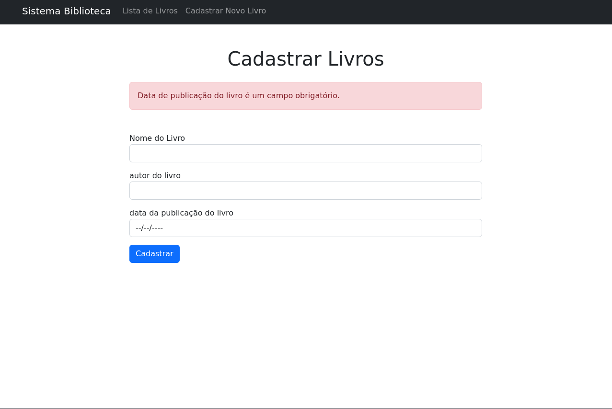
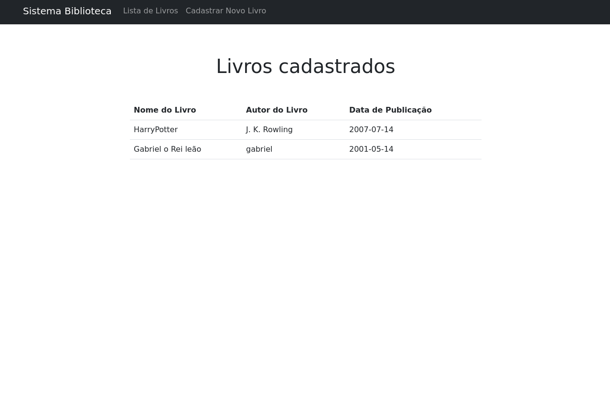

# Sistema Cadastro de livros de uma Biblioteca

Sistema criado com a finalidade de ser usado como modelo de teste de comprovação de conhecimentos UP estágio.

* Sistema permite fazer um cadastro de livros usando o banco de dados MongoDB
* Sistema permite Trazer esses dados do MongoDB para uma tabela frontend

<table>
    <tr>
        <td>Cadastro de Livros</td>
        <td>Lista de Livros Cadastrados </td>
    </tr>
    <tr>
        <td></td>
        <td></td>
    </tr>
</table>
<hr>
<br>
<br>
<br>

## 🚀 Começando
Baixe e instale o git:
```
https://git-scm.com/
```
Realize o clone do projeto em sua máquina:
```
git clone https://github.com/GabrielGM01/Cadastro-de-Livros-Nodejs-MongoDB-MVC.git
```
<br>
<br>
<hr>

### 📋 Pré-requisitos

Node.js

```
https://nodejs.org/en/
```
<br>
<br>
<hr>

## 🤺 Tecnologias utilizadas

<ul>
    <li>Bootstrap 5</li>
    <li>Node.js</li>
    <li>MongoDB</li>
    <li>Padrão de Arquitetura MVC</li>
</ul>

## 📚 Principais Bibliotecas utilizadas

<ul>
    <li>Express</li>
    <li>Mongoose</li>
    <li>Webpack</li>
    <li>ejs</li>
</ul>

<br>
<br>
<hr>

### 🔧 Instalação

Instalação das dependêcias do projeto

```
npm i
```

## ⚙️ Executando Servidor

```
npm start
```
<br>
<hr>

## ✒️ Criado por

* **Gabriel Gusmão**  [Linkedin](https://www.linkedin.com/in/gabriel-gusm%C3%A3o-moreno-034113199/)